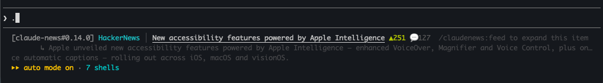
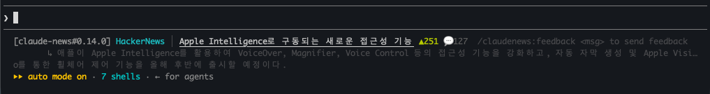

# claudenews — DevFeed for Claude Code

> **Switching to another task while Claude works costs you context.
> Just staring at the terminal is boring.** claudenews fills those short
> waits with dev news — so the idle time isn't wasted and you never lose
> your place.
>
> _Claude가 다른 명령을 처리하는 동안 다른 일을 하자니 컨텍스트 스위칭
> 비용이 들고, 터미널만 보고 있자니 심심하셨죠? 그 짧은 시간을 개발
> 뉴스로 채우고, 흐름은 그대로 유지하세요._

A Claude Code plugin that surfaces **Hacker News**, **GitHub Trending**, and
per-language dev & news sources in the status line during agent wait time —
auto-translated into your OS language, with short summaries that fade in as
Claude fetches them in the background.



The title is a clickable link, `▲` score / `💬` comments show for HN
items, and the trailing hint rotates through the commands (dropped
automatically if the terminal is too narrow). Korean / Japanese /
Chinese users see the **same item** auto-translated — no configuration:



## Install (30 seconds)

Inside Claude Code:

```
/plugin marketplace add bhpark1013/claudenews
/plugin install claudenews@claudenews
/reload-plugins
/claudenews:setup
```

`/reload-plugins` activates the hooks and slash commands without a full
restart. Then restart Claude Code once so the status line takes effect —
the next time the agent thinks, a news item rotates in.

## Why you might want this

- **No API key.** Translation and summary use your existing Claude Code session
  (Haiku, background-priced). No OpenAI key, no separate billing.
- **Auto-detects your OS language.** macOS `AppleLocale`, then `$LANG`,
  then Python locale. Korean, Japanese, Chinese, Spanish, etc. all work without
  configuration. English users get titles untranslated.
- **Coexists with your existing status line.** OMC HUD, git status, custom
  scripts — point at them via `parentStatusLine` in `~/.claudenews/config.json`
  and claudenews appends underneath rather than replacing.
- **Auto-fits your terminal width.** Detects cmux → tmux → iTerm2 → stty so
  titles & summaries truncate to the actual column count, not a static 120.
- **GitHub repo summaries are accurate.** When a GitHub repo's description is
  empty, claudenews falls back to the README's first paragraph via the GitHub
  API instead of showing "Contribute to … by creating an account on GitHub".
- **No separate windows.** Everything happens inline in your Claude Code
  session — the source list is a plain menu you read and toggle by id.

## Commands

The source list is the menu: run `/claudenews:list` to see every source
(id + flag + on/off) and toggle by id. You can also just **ask Claude in
plain language** — "show my news sources", "이 뉴스 자세히 보여줘",
"change the news language to Korean", "send claudenews feedback" — and
the right command runs automatically.

| Command | What it does |
|---|---|
| `/claudenews:setup` | Wire the status line wrapper (run once after install) |
| `/claudenews:update` | Update to the latest version in one step |
| `/claudenews:feed` | Expand the current news item (HN comments, repo page, etc.) |
| `/claudenews:feed latest` | Show the 5 most recent news items |
| `/claudenews:translate ko` | Force a target language (`ko`, `ja`, `zh`, `es`, …) |
| `/claudenews:translate off` | Disable translation |
| `/claudenews:list` | Show every source inline; toggle one or more by id (`/claudenews:list cnn bbc hn`) |
| `/claudenews:nav on` | Browse news with `ctrl+shift+←/→` (macOS; installs a Hammerspoon key tap) |
| `/claudenews:nav off` | Turn key navigation back off (per-session auto-rotation resumes) |
| `/claudenews:feedback` | Send feedback / a bug report / a feature request to the maintainer |
| `/claudenews:teardown` | Remove status line wiring (run before `/plugin remove`) |

## Keyboard navigation (optional, macOS)

By default the status line auto-rotates through news while the agent thinks.
If you'd rather step through items yourself, turn on key navigation:

```
/claudenews:nav on
```

- **`ctrl+shift+→`** next · **`ctrl+shift+←`** previous
- News becomes **global**: every Claude Code session shows the same item, so
  stepping moves them all together.
- Works in **iTerm2, Apple Terminal, WezTerm, kitty**. In any other app the
  shortcut is left untouched (so it still selects text in your browser/editor).

The key is captured by a tiny [Hammerspoon](https://www.hammerspoon.org) tap,
so `nav on` needs Hammerspoon installed:

```
brew install --cask hammerspoon
```

The only manual step is a one-time macOS **Accessibility** grant for Hammerspoon
— macOS pops the prompt the first time; click *Open System Settings* and toggle
it on. `nav on` restarts Hammerspoon for you and sets the status-line refresh to
1s so stepping feels instant. Disable it (and restore auto-rotation) anytime
with `/claudenews:nav off`.

## Updating

```
/claudenews:update
/reload-plugins
```

`/claudenews:update` pulls the latest version, refreshes the cache, and
updates the status-line launcher in one step. `/reload-plugins` then
activates the new hooks and commands (a Claude Code runtime action a
plugin can't do itself). You never need to re-run `/claudenews:setup` —
the status line auto-tracks the newest installed version.

## Sources

Sources are a catalog you choose from with `/claudenews:list`:

- **Hacker News** — top 50 (on by default, all users)
- **GitHub Trending** — popular repos created in the last 7 days (on by default, all users)
- Per-language native dev communities — the one matching your OS language
  turns on automatically; all are toggleable for anyone:
  - `geeknews` GeekNews — Korean (`ko`)
  - `qiita` Qiita 人気 — Japanese (`ja`)  ·  `zenn`, `hatena-it` (opt-in)
  - `v2ex` V2EX — Chinese (`zh`)  ·  `infoq-cn` (opt-in)
  - `habr` Habr — Russian (`ru`)
  - `jdh` Journal du hacker — French (`fr`)
  - `heise-dev` heise Developer — German (`de`)
  - `tabnews` TabNews — Portuguese / Brazil (`pt`)
- Global English (opt-in): `lobsters` Lobsters, `devto` DEV Community
- General world / national news (opt-in, not dev-focused, off by default):
  `cnn` CNN, `bbc` BBC News, `nyt` NYT World, `yonhap` 연합뉴스, `hani` 한겨레
  (Naver News has no public general RSS; Yonhap is the KR wire-service feed)
- More can be added server-side without a plugin update

The plugin picks sensible defaults on first run from your OS language.
`/claudenews:list` prints the full menu; `/claudenews:list cnn bbc hn`
toggles one or more by id. Public sources are fetched and cached by the
backend; your selection just tells it what to merge.

## Power-user config (`~/.claudenews/config.json`)

A few optional knobs you can set by hand (the plugin manages the rest):

- **`clientFeeds`** — add any RSS/Atom feed the backend can't reach, fetched
  from your own machine instead. Reddit is the headline case: it 403s
  datacenter IPs, but `www.reddit.com/r/<sub>/.rss` works from a normal
  machine. Items flow through rotation / nav / translation / summary exactly
  like built-in sources — there's no per-source code, just URLs:

  ```json
  "clientFeeds": [
    {"name": "👽 r/ClaudeAI", "url": "https://www.reddit.com/r/ClaudeAI/.rss"},
    {"name": "🐘 #rust", "url": "https://mastodon.social/tags/rust.rss", "lang": "en"}
  ]
  ```

- **`summaryColor`** — SGR color for the summary lines (default `38;5;245`, a
  readable gray). e.g. `"37"` plain white, `"38;5;250"` lighter, `"38;5;240"`
  dimmer.
- **`parentStatusLine`** — the status line claudenews chains underneath; set
  automatically at setup from whatever you had before.

## Privacy

- No prompts, no code, no keystrokes collected
- News is fetched on prompt submit, rate-limited to 30s per session
- Translation/summary uses your local Claude Code session — content never
  leaves your machine except to fetch the article meta description and the
  GitHub API for repo summaries
- All caches live under `~/.claudenews/`
- Anonymous install count: `/claudenews:setup` pings the backend **once**.
  The server only increments a single counter — no IP, user-agent, or
  identifier is read, stored, or logged. Offline just skips it silently.
- Feedback (`/claudenews:feedback`) is explicit and opt-in: only the
  message you type and the plugin version are sent and stored — no IP,
  user-agent, machine info, or identifier.

## Uninstall

```
/claudenews:teardown
/plugin remove claudenews
```

`teardown` restores whatever status line you had before install (from the
backup created at setup time) and removes `~/.claudenews/`.

## Development

```bash
cd web
npm install
npm run dev
```

Backend is a stateless Next.js 16 app on Vercel. `/api/news` interleaves
your selected sources (HN, GitHub Trending, and RSS feeds), cached 5 min
in-memory per function instance. No database and no per-user tracking —
the only persisted state is privacy-safe anonymous counters (install
count, feedback) with no IP/identifier ever stored.

## License

MIT
